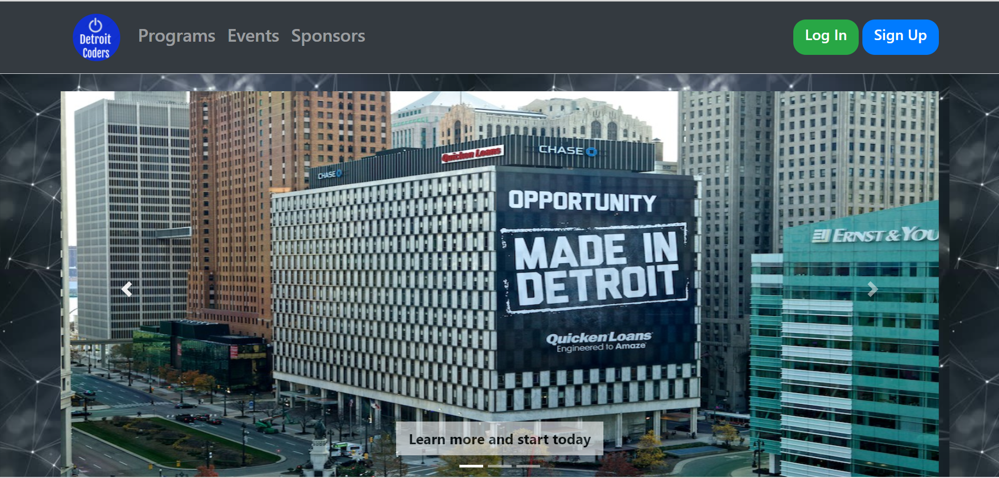
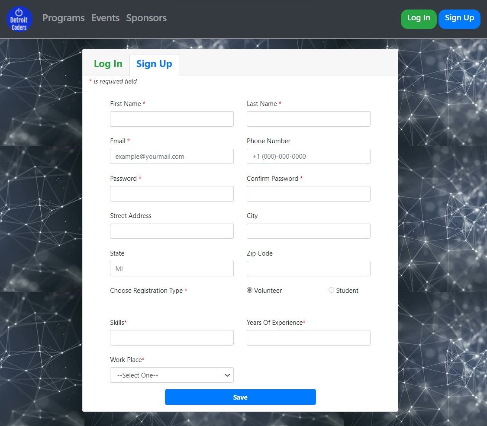
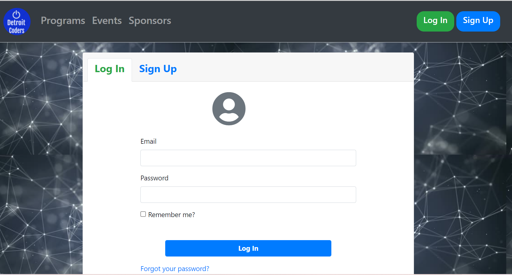
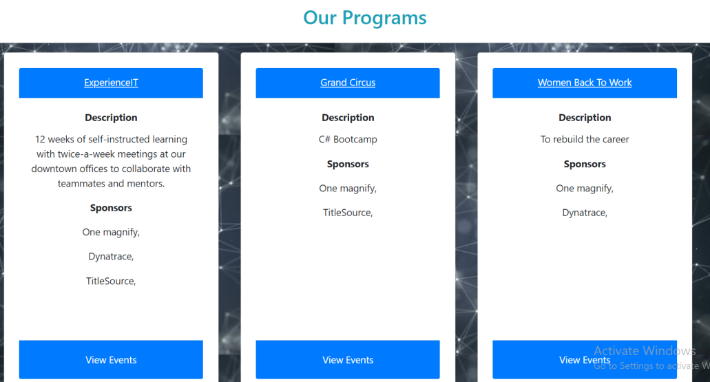
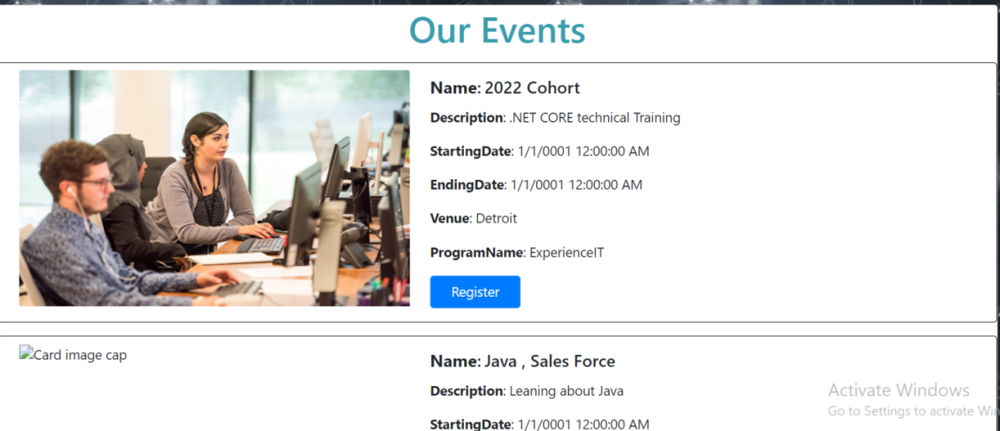
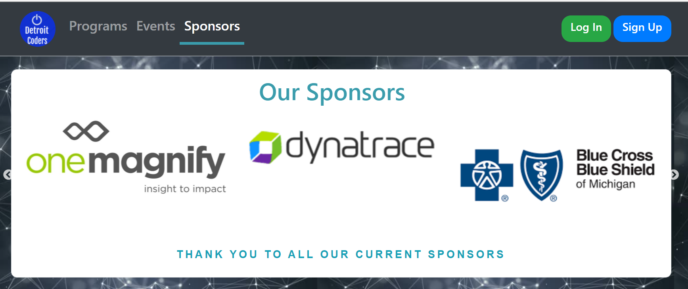
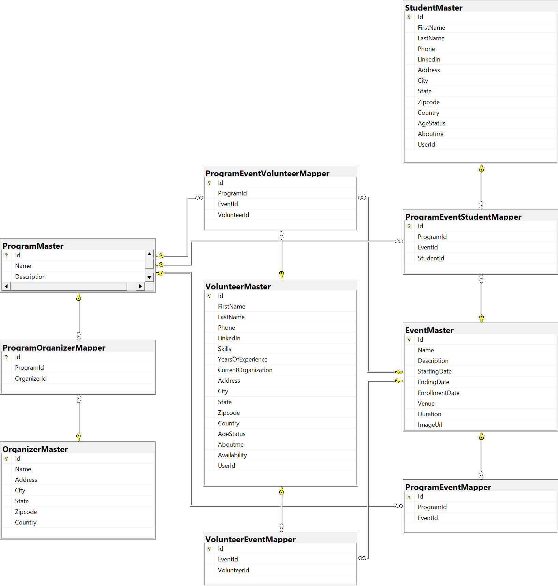

# About _Detroit Coders_

This project was assigned by `ExperienceIT Detroit program 2021` as part of final submission. The `project focus` is to provide a platform where different entities such as  `Volunteer, Student and Sponsor` come along and work together to teach, learn and prepare the next generation of IT professionals in Detroit.

## Table of contents

- [Overview](https://github.com/skalaiarasy/StudyBuddy#overview)
- [Personna](https://github.com/skalaiarasy/StudyBuddy#personna)
- [User Interface](https://github.com/skalaiarasy/StudyBuddy#user-interface)
- [Database](https://github.com/skalaiarasy/StudyBuddy#database)
- [Tools](https://github.com/skalaiarasy/StudyBuddy#tools)
- [Deployment](https://github.com/skalaiarasy/StudyBuddy#deployment)
- [References](https://github.com/skalaiarasy/StudyBuddy#references)

## Overview

The `Detroit Coders` is a web MVC application that provides the following key features.
 
- _Sponsor Management_
- _Program Management_
- _Event Management_
- _Volunteer Enrollment_
- _Student Enrollment_
- _User Authentication and Authorization_

## Personna

Key personnas of this application are as follows:

- **Application Admin**: 
  An `authenticated user` acts as an administrator of this application and has privileges to perform CRUD operations on Program, Event and Sponsor.
- **Volunteer**: 
  An `authenticated user` can register/unregister from an event for volunteering activities.
- **Student**: 
  An `authenticated user` can register/unregister from an event for learning purposes.
- **Guest**: 
  This `user` can browse the website without login.

## User Interface

Primary user interfaces of this application are as follows:

- **Home**
  
  

- **Signup**
  
  

- **Login**
  
  

- **Programs**
  
  

- **Events**
  
  

- **Sponsors**
  
  

## Database

The `Code-First migration approach` is used to create database tables in `SQL Server Developer Edition`.

- **Data Model**

  
  
- **List of Tables**

  Some of the key tables of this application are as follows:
  
  | Name  | Description |
  | ------------- | ------------- |
  | `AspNetUsers`  | Stores application users |
  | `AspNetRoles`  | Stores application roles |
  | `AspNetUserRoles` | Stores application user and role mappings |
  | `ProgramMaster` | Stores program details |
  | `EventMaster` | Stores event details |
  | `OrganizerMaster` | Stores participating organization details |
  | `VolunteerMaster` | Stores volunteer enrollment details |
  | `StudentMaster` | Stores student enrollment details |
  
  
- **Data Seed**
  
  Following table details out the data initialization requirements of this project.
  
  | Name  | Description |
  | ------------- | ------------- |
  | `ApplicationAdmin`  | Data (user & role mapping) is initialized for Admin in DBInitializer |
  | `Role`  | Roles are initialized when the application is started for the first time  |

## Tools

  Following table details out the list of `tools & technologies` used in this project.
  
  | Name | Description |
  | ------------- | ------------- |
  | `Frontend Languages` | Html, JavaScript, CSS |
  | `Frontend Libraries / Frameworks`  | Bootstrap, jQuery, Font Awsome, Bootbox, Cloudflare Ajax, W3Schools CSS, Slick JS  |
  | `Backend Languages` | C# |
  | `Backend Frameworks` | ASP.Net Core 3.1, EntityFrameworkCore |
  | `External API` | SendGrid for email confirmation |
  | `Database Technologies` | SQL Server Developer Edition 2019, SQL Server Management Studio (SSMS) |
  | `Web server` | IIS Express provided by Visual Studio |
  | `IDE` | Visual Studio 2019 / 2022 |
 
 
## Deployment

The application is developed and built using `Visual Studio` IDE, and is deployed into the `IIS Express` web server running on the localhost. The database is deployed into standalone/localhost `SQL Server` database, and is administered using `SQL Server Management Studio (SSMS)`.

- Application URL: https://localhost:44337/

## References

- For project reference: https://www.udemy.com/course/master-aspnet-core-mvc/ (Udemy Spice project by Bhrugen Patel)
- For troubleshooting: https://www.geeksforgeeks.org/, https://stackoverflow.com/, https://www.w3schools.com/
- For additional learning: https://docs.microsoft.com/en-us/
